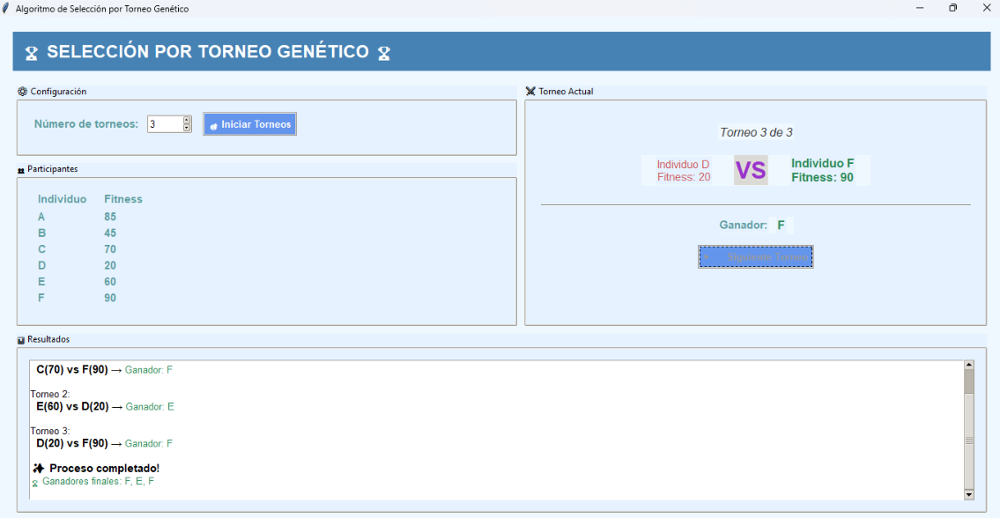
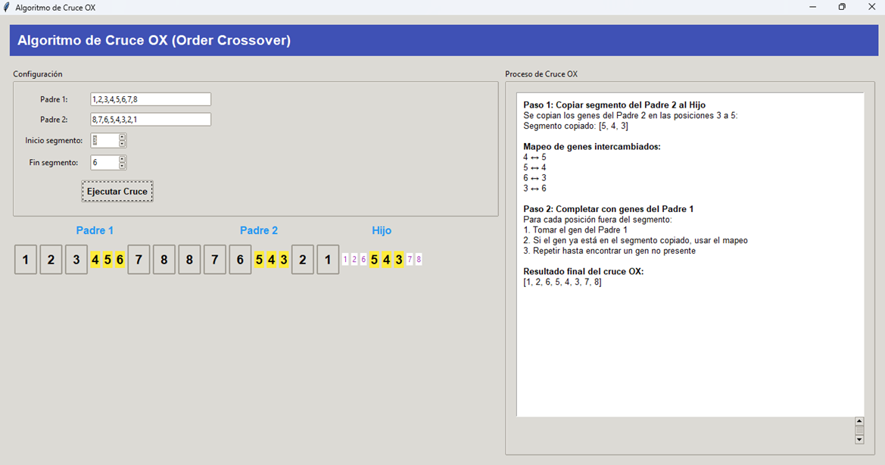

  

  
  

---

# Algoritmos Evolutivos – Actividad Semana 9  
**Universidad Nacional del Santa - UNS**  
**Curso:** Algoritmos Evolutivos de Aprendizaje – 2025-I  
**Docente:** Ing. Johan López Heredia  
**Integrantes del equipo:**
- Guevara Felipe Valentino
- Osorio Juaquin Edwin  
- Portal Ibañez Anderzon

---

## Descripción del Proyecto

Este proyecto presenta una simulación visual del operador genético **PMX (Partially-Mapped Crossover)** aplicado a representaciones permutacionales, utilizando una interfaz gráfica desarrollada en **Python con Tkinter**. Este tipo de operador se utiliza comúnmente en problemas donde el orden de los elementos es esencial, como el **Problema del Viajante (TSP)** o la distribución de estudiantes a exámenes, tal como fue abordado en esta actividad.

La aplicación permite:
- Definir los padres como listas permutacionales.
- Seleccionar el segmento de cruce.
- Visualizar el proceso paso a paso.
- Generar el hijo 1 conforme al algoritmo PMX.
- Mostrar el mapeo de los genes cruzados.

---

## Tecnología Utilizada

- **Lenguaje:** Python 3.10+
- **Librerías:** Tkinter (GUI)
- **Estilo visual:** ttk.Style personalizado
- **IDE:** VSCode

---

## Fragmentos Destacados de Ejecución

---

## Actividad 1 - Selección por torneo

---

## Actividad 2 - Cruce PMX

---

## Actividad 3 – Análisis Comparativo

**Pregunta 3.1 - Selección por Torneo vs Ruleta**

La **selección por torneo** es preferible cuando se busca:
- Mayor diversidad genética (evita convergencia prematura).
- Mejor manejo de poblaciones pequeñas.
- Robustez ante pequeñas diferencias de fitness.

**Pregunta 3.2 - Aplicación en TSP (20 ciudades)**

- **Representación:** Permutacional.
- **Cruce sugerido:** PMX o OX.
- **Justificación:** Ambos operadores preservan el orden y evitan repeticiones, características clave en problemas como el TSP.

---